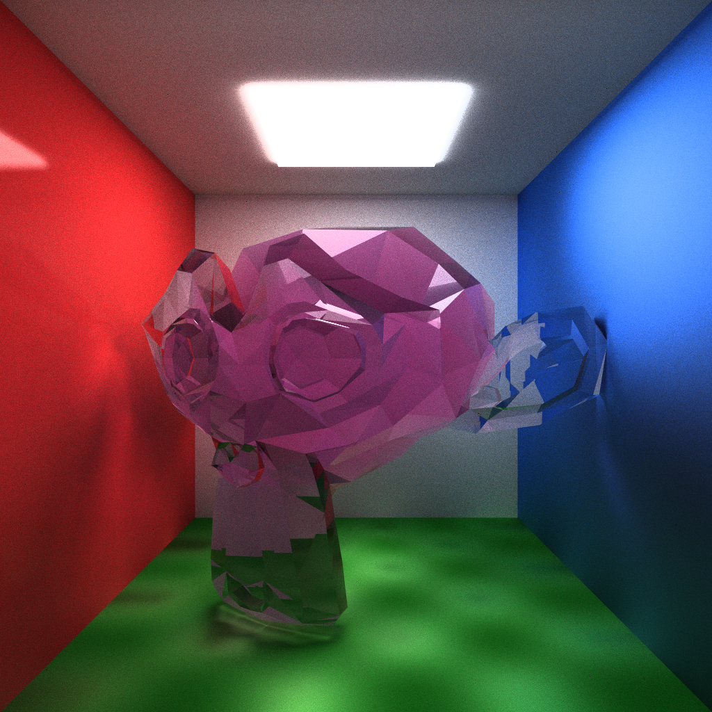

# cam0studios/raytracer

A fairly simple raytracer made with TypeScript and WebGPU

## Features

- Lambertian and dielectric materials
- Textures with different interpolation modes
- Hardware acceleration
- Optimized with a bounding volume hierarchy

## Example

Showcasing Lambertian and dielectric materials, as well as an interpolated texture

